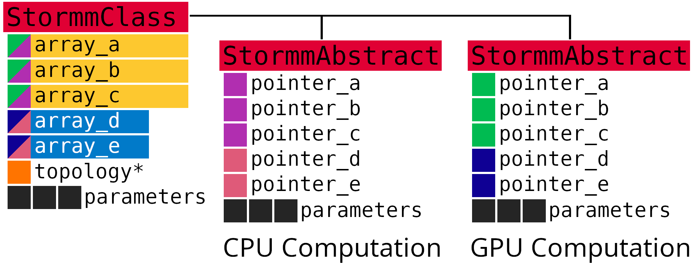

# The STORMM View of Coding for Molecular Science
Computational science is a practice of applying theory to scientific questions through numerical
models and simulations.  As such, it is best that scientists who want to develop methods have a
connection to the underlying numbers, and this is best achieved with a collection of modular and
open-source data structures tailored to the elemental operations of the simulation.  For molecular
modeling, the basic data structures are molecular topologies and coordinates, but most codes for
such computations mount the data in a series of individual arrays and are built for doing one or a
set number of such calculations at a time.

STORMM starts by creating its own unique classes for collecting molecular parameters and
coordinates, then makes these first-class C++ classes to take advantage of all functionality in the
[C++ Standard Library](https://en.cppreference.com/w/cpp/standard_library): objects of these
classes may be used in dynamic array allocation, passed to functions, returned by functions,
copied, and named as the developer likes.  The next step is to elaborate on the parameters and
coordinates with classes to interact with them, enabling simulations, evaluate the textbook
chemical structures out of thousands of atoms, and optimize compute-intensive aspects of a
simulation.

For more than a decade, computational science has been transformed by vectorized, general-purpose
graphics processors (GPUs).  The degree of efficiency afforded by this end point of non-uniform
memory access computing is staggering: a single consumer-grade card running on a few hundred watts
can perform more calculations than supercomputers of the past, based on single-core or multicore
processors.  The cards also deliver a much greater degree of parallel scaling: a supercomputer in
2005 might have delieverd as little as 5-10% efficiency on a parallel simulation sprawling over
hundreds of processors.  A GPU in 2025 may utilize upwards of 50% of its available floating point
instructions when propagating the same simulation.

In the modern computing environment, connecting scientists to the numbers in their calculations
also means providing a transparent and simple way to transfer that information to the GPU to
support GPU kernels (functions) which carry out the algorithm of interest.  GPU programming is
difficult due to the nature of finding errors among thousands of threads accessing a single block
of memory.  STORMM solves these problems with the style and standards of its C++ classes, letting
them produce abstracts of pointers and critical array sizes which can be submitted to GPU kernels
with much the same appearance as a function call in a C program.  Furthermore, all C++ classes are
built on a built-in dynamic memory format which manages allocations on both the GPU device and CPU
host, as well as transfers between them.  The C++ layer provides a means of organizing data and
testing its veracity with minimal obfuscation as might be encountered in something like a Python
program.  The class abstract convention in STORMM ensures that the algorithms and ideas carry over
to the GPU.

## Keep Dependencies Minimal

## C++ to C, and then to CUDA
STORMM is built to run [NVIDIA's CUDA](https://developer.nvidia.com/cuda-toolkit) for the time
being, although the code is written to make a transition to some agnostic state with respect to the
high-performance computing language.  The workflow for porting a new algorithm or memory structure
to the GPU is illustrated in the following diagram.  Starting with a C++ `class` containing data in
`Hybrid<T>` dynamically allocated arrays (as opposed to the C++ Standar Template Library
`std::vector<T>` dynamic memory allocation system), a class method is written to return a `struct`
containing critical array size constants and pointers to the relevant memory.  If the `class`
contained `std::vector<T>` arrays for its memory, a set of pointers to each array's `.data()`
member variable and constants for its `.size()` would, in effect, allow the developer to traverse
the `class` object's data s if it were a C `struct` object.  In STORMM, there is an additional
choice to make: while the size of any given array will be the same on the CPU or on the GPU, the
pointers can refer to data on the CPU host or on the GPU device.  The developer can still traverse
the host-side data as if it were a C `struct`, but also take the abstract with pointers to memory
on the device and traverse it with C-like CUDA.

In the above diagram, a hypothetical STORMM class contains five `Hybrid` arrays in two different
data types, e.g. `int` and `double`.  It also contains a pointer to another object, of the STORMM
topology type (this is called [`AtomGraph`](./doxygen/classstormm_1_1topology_1_1AtomGraph.html)
in the code, but that detail is irrelevant here).  The pointer to the STORMM topology, which may be
stored in the object as a way to trace the original inputs used to create / calculate its contents,
is only valid for the CPU, and therefore doesn't become part of the abstract.  Each of the `Hybrid`
arrays, however, hold valid pointers to data on the CPU host as well as on the GPU device, so the
abstract is created based on a choice of whether pointers should be directed towwards data on
either resource to facilitate computations there.  The `StormmClass` also contains a tuple of three
extra parameters, i.e. three `double` values, which are included in the abstract as constants.  The
abstract is a key to the data in the `class`--if the values of the tuple are changing over time,
the convention in most STORMM classes is to have the abstract be a snapshot of the class at any
given time, with `const` qualifiers on such values to treat them as constants.

## The Synthesis: Not Just an Array of Topologies or Coordinate Sets
It's easy to think of the 