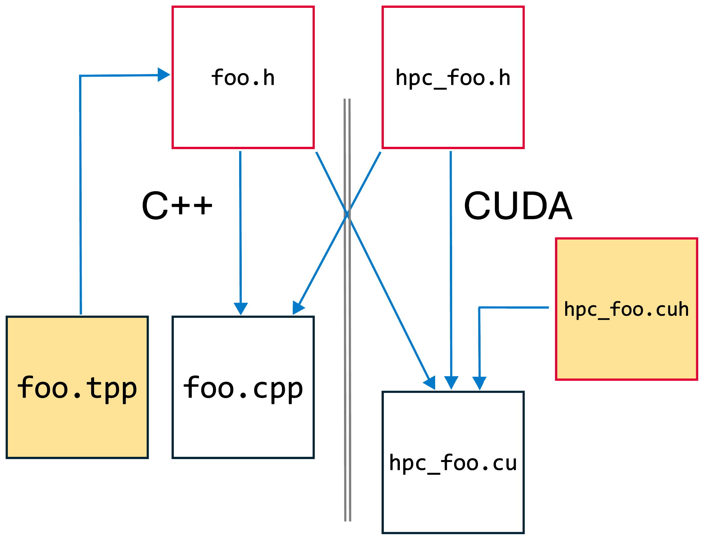

# A Basic GPU Program in STORMM
Begin at the beginning.  A GPU program will launch kernels on the device for massive parallel
processing in a
[Non-Uniform Memory Access (NUMA)](https://en.wikipedia.org/wiki/Non-uniform_memory_access) framework.  From the perspective of the host, one CPU thread will stage data on the GPU, copying
data from one resource to another, then launch kernels to process that data.  A serial CPU process
is the administrator for a series of workhorse GPU processes, and this is reflected in the C++ to
CUDA transition that STORMM facilitates for NVIDIA hardware.

## Overview
It starts with one array.  Constants can be sent to the GPU as kernel launch parameters, but
results from those kernels must, in general, be written to memory that the GPU can access (e.g. its
on-board memory, or
[memory on the host allocated in such a way that the GPU can see it](https://developer.download.nvidia.com/compute/DevZone/docs/html/C/doc/html/group__CUDART__MEMORY_g15a3871f15f8c38f5b7190946845758c.html).  The contents of the array can then be downloaded by the CPU in the same way that the CPU
can upload data to the device.  STORMM encapsulates memoory management through the templated
[`Hybrid` C++ class](../doxygen/classstormm_1_1card_1_1Hybrid.html).

The first step in writing the program is to recognize the GPU.  STORMM provides several classes to
identify and select all available GPUs on the system.  They are the
[`GpuDetails`](../doxygen/.html) and [`HpcConfig`](classstormm_1_1card_1_1HpcConfig.html) classes,
available by including the following header files.  When STORMM is compiled for High Performance
Computing (HPC) and the
[NVIDIA Compute Unified Device Architecture (CUDA)](https://developer.nvidia.com/cuda-zone)
framework, the `GpuDetails` header includes the requisite `cuda_runtime.h` library, but we can
replicate that below for clarity:
```
#ifdef STORMM_USE_HPC
#  ifdef STORMM_USE_CUDA
#    include <cuda_runtime.h>
#  endif
#endif
#include "/stormm/home/src/card/gpu_details.h"
#include "/stormm/home/src/card/hpc_config.h"
```
We also need access to the `Hybrid` template implementation and some enumerators to choose among
different options, which are available through:
```
#include "/stormm/home/src/card/gpu_enumerators.h"
#include "/stormm/home/src/card/hybrid.h"
```

Whenever designing a GPU program, the purpose is speed of execution, and a means of profiling the
code is therefore helpful.  While
[NVIDIA's `nvprof` tool](https://docs.nvidia.com/cuda/profiler-users-guide/) is useful for
measuring kernel execution speed, for many applications a great deal of time may be spent on the
CPU, staging the calculation.  If the GPU accelerates by 1000x something which is 99% of the run
time of a single-threaded, CPU program, then in a run that would have taken 100 seconds that
portion takes 0.099 seconds in a GPU-enabled code, but the CPU staging or post-processing portion
still takes one second, accounting for 90% of the wall time.  It can also be useful for users to
see the wall time of various parts of their calculations, to optimize their own workflows or
provide feedback to the developers.  For generating timings "in the wild", one cannot reply on a
profiler, and therefore STORMM provides a dedicated class, the
[`StopWatch`](classstormm_1_1testing_1_1StopWatch.html), for timing different segments of a
program.  Include:
```
#include "/stormm/home/src/UnitTesting/stopwatch.h"
```

## Allocating Fundamental Variables
The critical capabilities, to find a GPU and to initialize a timings apparatus, can be laid out in
the opening lines of the program.  Once the GPU is found, it is also helpful to do something such
as allocate an array on the device, to trigger NVIDIA firmware and prepare the card for use by the
program.
```
  StopWatch the_clock("STORMM Tutorial I");
  const int gpu_asgn_tm = the_clock.addCategory("Assign a GPU");
  const int gpu_prep_tm = the_clock.addCategory("Prep the GPU");
  the_clock.assignTime();
#ifdef STORMM_USE_HPC
  const HpcConfig gpu_config(ExceptionResponse::WARN);
  const std::vector<int> my_gpus = gpu_config.getGpuDevice(1);
  const GpuDetails gpu = gpu_config.getGpuInfo(my_gpus[0]);
  the_clock.assignTime("Assign a GPU");
  Hybrid<int> force_gpu_to_engage(1);
#  ifdef STORMM_USE_CUDA
  cudaDeviceSynchronize();
#  endif
  the_clock.assignTime("Prep the GPU");
  printf("This program is running on a %s card:\n", gpu.getCardName().c_str());
  printf("  Major.minor architecture version: %d.%d\n", gpu.getArchMajor(), gpu.getArchMinor());
  printf("  Streaming multiprocessors: %d\n", gpu.getSMPCount());
  printf("  Card RAM: %d megabtyes\n", gpu.getCardRam());
  printf("  Global cache size: %d bytes\n\n", gpu.getGlobalCacheSize());
#endif
```
The above code demonstrates how the [`GpuDetails`](classstormm_1_1card_1_1GpuDetails.html) class,
is a standard C++ class with constructors and accessors.  It can be returned by methods in other
classes or passed to functions that will manage GPU kernel launches.  Moreover, it is a wrapper for
various structs in CUDA or, potentially, other HPC languages that capture specs of a card in the
computer system.

The [`StopWatch`](classstormm_1_1testing_1_1StopWatch.html) class is intended to give developers
simple and efficient methods to assign the time spent between any two wall time measurements to one
of many customized, labeled bins.  The code above demonstrates assignment based on the name of the
bin.  As implied by the variables `gpu_asgn_time` and `gpu_prep_time`, each category in the time
tracking is given a unique integer value, which can also be used to index the right bin rather than
a search over name strings.

Aside from the tivial array which was allocated to force the GPU to engage, we can now create a
more substantial array and manipulate its contents.  The
[`Hybrid`](classstormm_1_1card_1_1Hybrid.html) class will only accept template types of familiar,
elemental types such as `int`, `double`, `char`, or `bool`.  It is not like the C++ Standard
Template Library `std::vector`, which can be a container for arrays of custom classes and typically
has optimized implementations for `std::vector<bool>`.  Some of the basic methods are similar, and
for this STORMM uses "camel case" rather than underscore-separated methods, to help developers see
when they are dealing with the STORMM dynamic memory class rather than the C++ standard.  The
subscript array index operator `[]` is not overloaded in `Hybrid` objects at this time.  One
feature of the `Hybrid` class is a developer-defined label that goes along with each array, which
will be displayed if range-checked memory accesses fail to expedite backtracing.

Let us also allocate an array to hold a number sequence.  The sequence will start at some value and
then ping-pong between two limits.
```
  // Create an array of integers on the CPU host and (if available) on the GPU device
  const int int_experiment_tm = the_clock.addCategory("Experiment with integers");
  Hybrid<int> xferable_integers(128, "Test_Int_Array");
  int ri = -5;
  for (size_t i = 0; i < xferable_integers.size(); i++) {
    xferable_integers.putHost(ri, i);
    if (i == 0) {
      ri++;
    }
    else if (ri == 16) {
      ri -= 2;
    }
    else if (ri == -8) {
      ri++;
    }
    else {
      if (xferable_integers.readHost(i - 1) < ri) {
        ri++;
      }
      else {
        ri -= 2;
      }
    }
  }
```

## Abstracts: Pointers to the Data 
This is an opportunity to demonstrate the C++ to C, C to CUDA strategy that guides much of STORMM's
development.  C++ made big improvements in its 2011 update, among them compilers getting smart
about seeing the subscript array operator on `std::vector` objects and optimizing the pointer
arithmetic to work at the same speed as the original C implementations.  CUDA needs pointers to
work best, not classes with methods implemented on the CPU.  The common space on the Venn diagram
is, therefore, to take a valid pointer to the data in an array and access data as if the program
were written in C.  We need to set the pointer again if the array is resized and do not know just
by looking at the pointer how much valid memory is allocated behind it, but the most common bugs
with arrays involve requesting an array subscript index that is out of bounds, and `std::vector`
will not check the index anyway.  We will use this method to print all contents of the array in a
human-readable format:
```
  // Grab a pointer to the array's host-side data and print the contents
  const int* host_xi_ptr = xferable_integers.data(HybridTargetLevel::HOST);
  const int nxi = xferable_integers.size();
  printf("Contents of xferable_integers:\n  ");
  for (int i = 0; i < nxi; i++) {
    printf(" %3d", host_xi_ptr[i]);
    if ((i + 1) % 16 == 0 || i == nxi - 1) {
      printf("   (%3d)\n  ", i + 1);
    }
  }
  printf("\n");
```
This strategy of creating pointers and length constants to traverse arrays is taken to a higher
degree in the class abstract approach found throughout much of STORMM, as will be evident in later
tutorials.

## Analysis of the Data on the CPU and the GPU
Next, we can consider some operation that involves the array as a whole: the sum of all elements.
This is trivial to do in a single-threaded C program by looping over each element, as was done
above to display the values.  In general, we must consider cases where the array might be so large
that the data type used to hold the summation might break: a floating point value could overflow to
`NaN` or `Inf`, but more likely a 32-bit `int` could be overwhelmed by combining a million values
in the range of 10,000.  We don't need to worry with the problem at hand, but this sort of safety
is what drives a lot of the details in general-purpose code.

Summing the contents of an array in CUDA is very much like taking their sum in another parallel
programming scheme: divide the problem into non-overlapping parts, delegate, and then combine the
results.  It's not within the scope of the present tutorial to delve into the particulars of
kernel writing, which is also covered on many other forums.  This is an opportunity to talk about
how STORMM deals with code bloat and makes C++ templating amenable to CUDA in light of the above
vulnerability, which necessitates versatility in the choice of data types.  A typical C++ program
cannot launch a CUDA kernel unless it was compiled directly by the NVIDIA CUDA compiler.  STORMM
is built to work in a CPU-only environment, to compile without the benefits of CUDA, so that
development can continue and features that do not involve massive number crunching remain
accessible on machines without compatible GPUs.

## Templating and the Transition from C++ to CUDA
In order to launch a CUDA kernel, we must write a separate CUDA unit, with a **.cu** rather than
**.cpp** extension.  The CUDA unit will also be able to understand templated CUDA kernels, files
that STORMM stuffs into files with **.cuh** extensions (while many C++ programmers write templated
functions in the header files where the function is first mentioned, STORMM takes a convention of
creating a separate **.tpp** file for the implementation as opposed to the declaration).  The
**.cu** file will contain the implementation of a function to take an array of a given data type
and compute the sum.  For complete generality, we would again need to allow that the sum be
computed in a distnct data type, longer in format than the type of the array elements, but we can
assume the same type for each in this example.  The C++ program cannot be told to `#include` any
CUDA template implementations--the function within the **.cu** file will take an array and then
delegate to some templated form of a CUDA kernel that only the CUDA unit knows about.  C++ doesn't
know what a CUDA kernel is, much less a template implementation for a kernel.  However, the C++
program will `#include` the header describing the launching function, as illustrated with blue
arrows in the following diagram:



In the same way that a C++ program cannot `#include` CUDA code, in our case critical headers for
templated kernels, the CUDA unit will not be able to accept templated inputs from the C++ compiled
code object file.  Rather, we must convert all pointers to a specific type to pass through the
C++ : CUDA barrier, then undo the conversion on the other side.  This is done via the universal
C pointer type, `void*`.  We will convert the pointers for our array of integers, as well as the
buffer array we are using to hold the answers from each GPU thread block, to `void*`, then codify
the `int` data type and pass that as another input parameter to the CUDA unit.  The type index
of the `int` data type is computed by STORMM at runtime and is available through the `data_types`
library.  As a final condition, we must take the pointer to our array's data on the GPU device, not
on the CPU host.  Because the data in the integer array is not intended to change during the
summation, we will `const` qualify that pointer as well as its `void*` alias. (Aside, it's OK to
feed the `int*` pointers to a function that expects to take `void*`.  The conversion will be
automatic, although the tutorial avoids this shorthand for clarity.) A summary of the code:
```
#include "/stormm/home/src/DataTypes/common_types.h"

  // Allocate a buffer for the answer
  Hybrid<int> sum_of_xi(gpu.getSMPCount(), "Our_Answer");
  const int* devc_xi_ptr = xferable_integers.data(HybridTargetLevel::DEVICE);
  const void* vdevc_xi_ptr = reinterpret_cast<const void*>(devc_xi_ptr);
  int* sum_ptr = sum_of_xi.data(HybridTargetLevel::DEVICE);
  void* vsum_ptr = reinterpret_cast<void*>(sum_ptr);  
```

All that remains on the C++ side is to stage the data on the GPU and then issue a call to the
function that will launch the kernel (a memory transfer to or from the GPU can be called from a
C++ compiled code object, even though a kernel cannot).  The relevant code:
```
xferable_integers.upload();
wrapTheSummationLaunch(vdevc_xi_ptr, nxi, vsum_ptr, int_type_index, gpu);
```

In the example above, we used a single `Hybrid` object as an example of STORMM's conventions for
transmitting templated data from the C++ layer to the CUDA layer.  The "abstract" of the `Hybrid`
object is just the one pointer, along with the array size.  For STORMM classes built on templated
`Hybrid` objects, the method is then:
- Write a class method to emit an abstract with all pointers cast to `void*`
- Write a class method to accomplish the inverse: restoring the data type(s) of each pointer
- Feed the class header file to both the C++ and CUDA implementation files.
- Invoke the first method to create the "de-templated" abstract on the C++ side, then "send it to
  the CUDA side" by submitting it as an input argument to some function, e.g. one of the kernel
  wrappers, in the CUDA unit.
- Kernels launched on the CUDA side will then operate on the class object's data, and the C++ side
  can download the results.
The above procedure works because, even though the CUDA unit does not understand a templated form
of some class object created by the C++ code (and vice-versa, the binary **.o** files were created
by different compilers), both compilers were told how to make their own rendition of the templated
class itself, and both can interpret a specifically typed instance of the class, e.g. `void*`.  The
`AtomGraph` class has templated abstracts, but it enumerates the various data formats (`float` and
`double`) that these abstracts can take, and with a particular format passed to each function on
the CUDA side we do not need the above workflow.  An extreme example of the "cast to `void*` and
then restore" paradigm can be seen in the
[`CellGrid` class](../doxygen/classstormm_1_1energy_1_1CellGrid.html), where four unique data types
are all cast to void and the `restoreType` class method takes data type indices for all of them.

## The CUDA Side of Things
The code for our CUDA unit is not complex.  It must define an implementation for the wrapper
function `wrapTheSummationLaunch`, which branches over various recognized arithemtic types to be
summed:
```
extern void wrapTheSummationLaunch(const void* vdata, const size_t n, void* vresult,
                                   const size_t ct_data, const GpuDetails &gpu) {
  if (ct_data == int_type_index) {
    const int* data = reinterpret_cast<const int*>(vdata);
    int* result = reinterpret_cast<int*>(vresult);
    kSumVector<int, int><<<gpu.getSMPCount(), large_block_size>>>(data, n, result);
  }
  else if (ct_data == llint_type_index) {
    const llint* data = reinterpret_cast<const llint*>(vdata);
    llint* result = reinterpret_cast<llint*>(vresult);
    kSumVector<llint, llint><<<gpu.getSMPCount(), large_block_size>>>(data, n, result);
  }
  else if (ct_data == double_type_index) {
    const double* data = reinterpret_cast<const double*>(vdata);
    double* result = reinterpret_cast<double*>(vresult);
    kSumVector<double, double><<<gpu.getSMPCount(), large_block_size>>>(data, n, result);
  }
  else if (ct_data == float_type_index) {
    const float* data = reinterpret_cast<const float*>(vdata);
    float* result = reinterpret_cast<float*>(vresult);
    kSumVector<float, float><<<gpu.getSMPCount(), large_block_size>>>(data, n, result);
  }
}
```
Note the presence of the `extern` qualifier in the CUDA implementation file.  This does not apply
to the function declaration in the associated header file.

The sum of the contents in our array may be computed on the host as well.  It is 522.  To check the
result, we can use one of STORMM's built-in vector math functions:
```
#include "/stormm/home/src/Math/vector_ops.h"

  printf("The sum of the set of integers on the host is:          %d\n", sum<int>(host_xi_ptr));
```
The summation is overloaded to accept a Hybrid object, a `std::vector<T>`, or a C-style array with
a trusted length.  Many other vector-applicable functions work the same way.  For summations in
particular, if a valid [`GpuDetails`](classstormm_1_1card_1_1GpuDetails.html) object is provided,
the summation will run over the data present on the GPU device, with the option to have a temporary
buffer array created just for that process (no need for manual allocation of `sum_of_xi` as we did
above).  However, overloads of the `sum` function that accept GPU inputs are currently only
callable from CUDA units.  Other overloads are callable from both C++ and CUDA code, as is seen
above.  One other thing to note is that the `sum` function does take two formal template arguments,
one for the data and another for the type to store the running sum--the data type is inferred from
the input, while the type of the running sum is provided in the `sum<int>` call.

## The `StopWatch` for Tracking Wall Time
As a final analysis, we can add lines to check the timing of various operations.  The various
categories we laid out can take contributions as has been shown.  The
[`StopWatch`](classstormm_1_1testing_1_1StopWatch.html) class relies on the
[ANSI-C `gettimeofday()`](https://pubs.opengroup.org/onlinepubs/009604599/functions/gettimeofday.html)
function and has a precision of microseconds.  To summarize:
```
#include "../../src/UnitTesting/stopwatch.h"

  Stopwatch the_clock("STORMM Tutorial I");
  const int gpu_asgn_tm = the_clock.addCategory("Assign a GPU");
  const int gpu_prep_tm = the_clock.addCategory("Prep the GPU");
  const int int_experiment_tm = the_clock.addCategory("Experiment with integers");
  
  // Assign time since last measurement based on category name (slower, use only in high-level
  // procedures)
  the_clock.assignTime("Assign a GPU");

  // Assign time since last measurement based on category index (faster, use when taking repeated
  // samples during an inner loop)
  the_clock.assignTime(int_experiment_tm);

  // Assign time since last measurement to the default "miscellaneous" category (specify index 0,
  // or call with no argument)
  the_clock.assignTime();
  the_clock.assignTime(0);
  
  // Print the timings results (precision optional)
  the_clock.printResults();
```

## Compilation
The program discussed in this tutorial can be found in the following files:
- **/stormm/home/apps/Tutorial/tutorial_i.cpp** (C++ implementation)
- **/stormm/home/apps/Tutorial/hpc_tutorial_i.cu** (CUDA unit)
- **/stormm/home/apps/Tutorial/hpc_tutorial_i.h** (header for inclusion by the C++ program)

The CMake file **/stormm/home/apps/CMakeLists.txt** is configured to look in the Tutorial folder
for any additional instructions (which will take the form of another **CMakeLists.txt** file).
Those instructions for this program are:
```
set(APP_NAME "tutorial_i.${STORMM_APP_SUFFIX}")

add_executable(${APP_NAME}
        ${CMAKE_CURRENT_SOURCE_DIR}/tutorial_i.cpp
        ${CMAKE_CURRENT_SOURCE_DIR}/hpc_tutorial_i.cu
        ${CMAKE_CURRENT_SOURCE_DIR}/hpc_tutorial_i.h)

target_sources(${APP_NAME} PRIVATE ${CMAKE_CURRENT_SOURCE_DIR}/tutorial_i.cpp)

target_link_libraries(${APP_NAME} ${PROJECT_NAME})

install(TARGETS ${APP_NAME}
        RUNTIME DESTINATION ${CMAKE_INSTALL_BINDIR})
```
New programs written by developers can be created in the local **/stormm/home/apps/Tutorial/**
directory, with modest local edits to the **CMakeLists.txt** file in that directory, to test
personal projects created in STORMM.

The templated implementations for C++ summation can be found in
**/stormm/home/src/Math/summation.tpp** (included by
**/stormm/home/apps/Tutorial/tutorial_i.cpp**), while templated implementations for CUDA kernels
are found in **/stormm/home/src/Math/hpc_summation.cuh** (included by
**/stormm/home/apps/Tutorial/hpc_tutorial_i.cu**)

With STORMM built, the pre-installed tutorial can be run on the command line:
```
>> /stormm/build/dir/apps/Tutorial/tutorial_i.stormm.cuda

This program is running on a NVIDIA GeForce RTX 4090 card:
  Major.minor architecture version: 8.9
  Streaming multiprocessors: 128
  Card RAM: 24176 megabtyes
  Global cache size: 75497472 bytes

Contents of xferable_integers:
    -5  -4  -3  -2  -1   0   1   2   3   4   5   6   7   8   9  10   ( 16)
    11  12  13  14  15  16  14  12  10   8   6   4   2   0  -2  -4   ( 32)
    -6  -8  -7  -6  -5  -4  -3  -2  -1   0   1   2   3   4   5   6   ( 48)
     7   8   9  10  11  12  13  14  15  16  14  12  10   8   6   4   ( 64)
     2   0  -2  -4  -6  -8  -7  -6  -5  -4  -3  -2  -1   0   1   2   ( 80)
     3   4   5   6   7   8   9  10  11  12  13  14  15  16  14  12   ( 96)
    10   8   6   4   2   0  -2  -4  -6  -8  -7  -6  -5  -4  -3  -2   (112)
    -1   0   1   2   3   4   5   6   7   8   9  10  11  12  13  14   (128)

The sum of the set of integers on the host is:          522
Before downloading, the sum of the answer buffer reads: 0
After downloading, the sum of the answer buffer reads:  522

Timings data for STORMM Tutorial I (4 categories, total 0.1238 seconds):

 +--------------------------+--------------------------------------------------------+
 |      Category Name       | Samples   Total    Mean    Standard   Minimum  Maximum |
 |                          |          Time, s  Time, s  Deviation  Time, s  Time, s |
 +--------------------------+--------------------------------------------------------+
 | Miscellaneous            |       2   0.0002   0.0001     0.0001   0.0000   0.0002 |
 | Assign a GPU             |       1   0.1225   0.1225     0.0000   0.1225   0.1225 |
 | Prep the GPU             |       1   0.0010   0.0010     0.0000   0.0010   0.0010 |
 | Experiment with integers |       1   0.0000   0.0000     0.0000   0.0000   0.0000 |
 +--------------------------+--------------------------------------------------------+
```
As any CUDA tutorial will explain, the host-side data is independent of the device-side data, so
the answer will not be known on the host until the download is complete.  The `Hybrid` array
`xferable_integers` was allocated in the default `HybridFormat::EXPEDITED` mode, as no format was
specified in the constructor.  This allocates page-locked memory on the host and separate memory on
the device.  Had the array been allocated in `HybridFormat::UNIFIED` mode,
[CUDA's "managed memory" system](https://developer.nvidia.com/blog/unified-memory-cuda-beginners/)
would have created a type of memory which, in reality, takes up separate space on both the host and
device.  But, through the magic of NVIDIA's Page Migration Engine, the two arrays are always
synchronized line for line in the code.  No download would have been necessary, but if the
developer knows when downloads or uploads will be needed, `HybridFormat::EXPEDITED` is more
efficient.  Convenient features like this are incorporated into many of STORMM's basic objects.

## Summary
This tutorial covered the basics of setting up a new program in the STORMM code base, establishing
a wall time monitor, and moving memory onto and off of the GPU.  In the program execution, we see
that the process of identifying a GPU, while short, is lengthy compared to the speed at which a
computer might process even a million array elements.  In later tutorials, we will demonstrate how
the `Hybrid` dynamic array class builds topologies, coordinate objects, and other aspects of the
code for chemical analysis.
